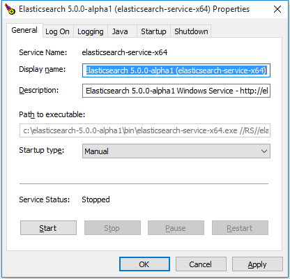

## .zip在Windows安装

可以使用`.zip`包在Windows上安装Elasticsearch。其中附带了`elasticsearch-service.bat`命令，该命令将Elasticsearch设置为作为服务运行。

> **提醒**
>
> 以前Elasticsearch使用`.zip`在Windows上安装。现在提供了一个 [MSI安装程序包](../../02-Set-up-Elasticsearch/Installing-Elasticsearch/Install-Elasticsearch-with-Windows-MSI-Installer.md)，可为Windows提供最简单的入门体验。如果您愿意，可以继续使用`.zip`方法。

此软件包可在Elastic许可下免费使用。它包含开源和免费商业功能以及付费商业功能。开始 [为期30天的试用](https://www.elastic.co/guide/en/elastic-stack-overview/6.7/license-management.html)，试用所有付费商业功能。有关Elastic许可级别的信息，请参阅 [订阅](https://www.elastic.co/cn/subscriptions) 页面。

可以在 [Elasticsearch下载](https://www.elastic.co/cn/downloads/elasticsearch) 页面上找到最新的稳定版Elasticsearch。其他版本可在 [历史版本](https://www.elastic.co/downloads/past-releases) 页面上找到。

> **注意**
>
> Elasticsearch需要Java 8或更高版本。使用 [官方Oracle发行版](https://www.oracle.com/technetwork/java/javase/downloads/index.html) 或 [OpenJDK](http://openjdk.java.net) 等开源发行版。

### 下载并安装.zip包

从以下网址下载Elasticsearch v6.7.1的`.zip`存档：

https://artifacts.elastic.co/downloads/elasticsearch/elasticsearch-6.7.1.zip

或者，您可以下载以下软件包，其中仅包含Apache 2.0许可下提供的功能：

https://artifacts.elastic.co/downloads/elasticsearch/elasticsearch-oss-6.7.1.zip

用你的解压缩工具解压缩。这将创建一个`elasticsearch-6.7.1`文件夹，我们将其称为`％ES_HOME％`。在终端窗口中，`cd`到`％ES_HOME％`目录，例如：

```sh
cd c:\elasticsearch-6.7.1
```

### 启用X-Pack自动创建索引

X-Pack将尝试在Elasticsearch中自动创建多个索引。默认情况下，Elasticsearch配置为允许自动创建索引，不需要其他步骤。但是，如果在Elasticsearch中禁用了自动索引创建，则必须在`elasticsearch.yml`中配置 [`action.auto_create_index`](../../05-Document-APIs/Index-API.md)，以允许X-Pack创建以下索引：

```yaml
action.auto_create_index: .monitoring*,.watches,.triggered_watches,.watcher-history*,.ml*
```

> **重要**
>
> 如果您使用的是 [Logstash](https://www.elastic.co/products/logstash) 或 [Beats](https://www.elastic.co/products/beats)，则很可能在`action.auto_create_index`设置中需要其他索引名称，具体值取决于您的本地配置。如果您不确定环境的正确值，可以考虑将值设置为`*`，这将允许自动创建所有索引。

### 命令行运行

可以从命令行启动Elasticsearch，如下所示：

```bat
.\bin\elasticsearch
```

默认情况下，Elasticsearch在前台运行，将其日志打印到标准输出（`stdout`），并可以通过按`Ctrl-C`来停止。

### 命令行配置

默认情况下，Elasticsearch从`%ES_HOME%\config\elasticsearch.yml`文件加载配置。[配置](../../02-Set-up-Elasticsearch/Configuring-Elasticsearch.md) 中介绍了此配置文件的格式。

也可以在命令行中使用`-E`语法指定配置文件中的任何设置项，如下所示：

```sh
.\bin\elasticsearch.bat -Ecluster.name=my_cluster -Enode.name=node_1
```

> **注意**
>
> 包含空格的值必须用引号括起来。例如 `-Epath.logs="C:\My Logs\logs"`。

> **提醒**
>
> 通常，应将所有群集通用的设置（如 `cluster.name`）添加到`elasticsearch.yml`配置文件中，而可以在命令行上指定任何特定于节点的设置（如 `node.name`）。

### 检查运行情况

您可以通过向`localhost`上的端口`9200`发送HTTP请求，来测试您的Elasticsearch节点是否正在运行：

```sh
GET /
```

应该会给你一个像这样的响应：

```json
{
  "name" : "Cp8oag6",
  "cluster_name" : "elasticsearch",
  "cluster_uuid" : "AT69_T_DTp-1qgIJlatQqA",
  "version" : {
    "number" : "6.7.1",
    "build_flavor" : "default",
    "build_type" : "zip",
    "build_hash" : "f27399d",
    "build_date" : "2016-03-30T09:51:41.449Z",
    "build_snapshot" : false,
    "lucene_version" : "7.7.0",
    "minimum_wire_compatibility_version" : "1.2.3",
    "minimum_index_compatibility_version" : "1.2.3"
  },
  "tagline" : "You Know, for Search"
}
```

### Windows安装Elasticsearch服务

Elasticsearch可以作为服务安装，以便在后台运行，也可以在启动时自动启动，无需任何用户交互。这可以通过`bin\`文件夹中的 `elasticsearch-service.bat`脚本来实现，该脚本允许用户安装，删除，管理或配置服务，并可从命令行启动和停止服务。

```sh
c:\elasticsearch-6.7.1\bin>elasticsearch-service.bat

Usage: elasticsearch-service.bat install|remove|start|stop|manager [SERVICE_ID]
```

该脚本需要一个参数（要执行的命令），后跟一个指定服务ID的可选参数（在安装多个Elasticsearch服务时很有用）。

可用的命令是：

| 命令      | 说明                                                  |
| --------- | ----------------------------------------------------- |
| `install` | 将Elasticsearch安装为服务                             |
| `remove`  | 删除已安装的Elasticsearch服务（如果已启动则停止服务） |
| `start`   | 启动Elasticsearch服务（如果已安装）                   |
| `stop`    | 停止Elasticsearch服务（如果已启动）                   |
| `manager` | 启动GUI以管理已安装的服务                             |

安装期间将提示服务名称和`JAVA_HOME`的值：

```sh
c:\elasticsearch-6.7.1\bin>elasticsearch-service.bat install
Installing service      :  "elasticsearch-service-x64"
Using JAVA_HOME (64-bit):  "c:\jvm\jdk1.8"
The service 'elasticsearch-service-x64' has been installed.
```

> **注意**
>
> 虽然JRE可以用于Elasticsearch服务，但由于它使用了客户端VM，而不是为长期运行的应用程序提供更好性能的服务器JVM，因此不鼓励使用，会有警告消息。

> **注意**
>
> 应将系统环境变量`JAVA_HOME`设置为您希望服务使用的JDK安装的路径。如果升级JDK，则不需要重新安装服务，但必须将系统环境变量`JAVA_HOME`设置为新JDK安装的路径。但是，跨JVM类型（例如JRE与SE）升级不被支持，并且确实需要重新安装该服务。

### 自定义服务设置

可以在安装之前通过设置以下环境变量（使用命令行中的 [set命令](https://docs.microsoft.com/en-us/previous-versions/windows/it-pro/windows-server-2008-R2-and-2008/cc754250(v=ws.10))，或通过`System Properties-> Environment Variables` GUI）配置Elasticsearch服务。

| 变量                   | 说明                                                         |
| ---------------------- | ------------------------------------------------------------ |
| `SERVICE_ID`           | 服务的唯一标识符。在同一台机器上安装多个实例时很有用。默认为`elasticsearch-service-x64`。 |
| `SERVICE_USERNAME`     | 要运行的用户，默认为本地系统帐户。                           |
| `SERVICE_PASSWORD`     | `％SERVICE_USERNAME％`中指定的用户密码。                     |
| `SERVICE_DISPLAY_NAME` | 服务的名称。默认为`Elasticsearch <version>％SERVICE_ID％`    |
| `SERVICE_DESCRIPTION`  | 服务的描述。默认为`Elasticsearch <version> Windows Service -  https://elastic.co`。 |
| `SERVICE_DESCRIPTION`  | 要在其下运行服务的所需JVM的安装目录。                        |
| `SERVICE_DESCRIPTION`  | 服务日志目录，默认为`％ES_HOME％\logs`。请注意，这不会控制Elasticsearch日志的路径；这些路径通过`elasticsearch.yml`文件中的设置`path.logs`或命令行设置。 |
| `ES_PATH_CONF`         | 配置文件目录（需要包含`elasticsearch.yml`，`jvm.options`和`log4j2.properties`文件），默认为`％ES_HOME％\config`。 |
| `ES_JAVA_OPTS`         | 您可能想要应用的任何其他JVM系统属性。                        |
| `ES_START_TYPE`        | 服务的启动模式。可以是`auto`或`manual`（默认）。             |
| `ES_STOP_TIMEOUT`      | procrun等待服务正常退出的超时（以秒为单位）。默认为`0`。     |

> **注意**
>
> `elasticsearch-service.bat`的核心是依赖 [Apache Commons Daemon](http://commons.apache.org/proper/commons-daemon/) 项目来安装该服务。在服务安装之前设置的环境变量将被复制，并将在服务生命周期中使用。这意味着除非重新安装服务，否则在安装后对它们所做的任何更改都将无法获取。

> **注意**
>
> 在Windows上，当从命令行运行Elasticsearch时，或者首次将Elasticsearch作为服务安装时，都可以配置 [堆大小](../../02-Set-up-Elasticsearch/Important-Elasticsearch-configuration/Setting-the-heap-size.md)。要调整已安装服务的堆大小，请使用服务管理器：`bin\elasticsearch-service.bat manager`。

> **注意**
>
> 该服务自动配置私有临时目录，以供Elasticsearch运行时使用。此专用临时目录配置为安装的专用临时目录的子目录。如果服务将在其他用户下运行，则可以在执行服务安装之前，通过将环境变量`ES_TMPDIR`设置为首选位置，来配置服务应使用的临时目录的位置。

**使用管理器GUI**

在使用管理器GUI（`elasticsearch-service-mgr.exe`）安装服务之后，还可以对服务进行配置，该GUI提供已安装服务的详细信息，包括其状态，启动类型，JVM，启动和停止设置等。 只需从命令行调用`elasticsearch-service.bat manager`即可打开管理器窗口：

通过管理器GUI进行的大多数更改（如JVM设置）都需要重新启动服务才能生效。

### .zip文档目录结构

`.zip`包完全是独立的。默认情况下，所有文件和目录都包含在`$ES_HOME`中——解压缩归档时创建的目录。

这非常方便，因为您不必创建任何目录来开始使用Elasticsearch，卸载Elasticsearch就像删除`$ES_HOME`目录一样简单。但是，建议更改config目录，数据目录和logs目录的默认位置，以便以后不删除重要数据。

| 文件夹      | 描述                                                         | 默认位置             | 设置项                                                       |
| ----------- | ------------------------------------------------------------ | -------------------- | ------------------------------------------------------------ |
| **home**    | Elasticsearch根目录或`$ES_HOME`                              | 安装包解压缩到的目录 |                                                              |
| **bin**     | 二进制脚本，包含启动节点的`elasticsearch`和安装插件的`elasticsearch-plugin`命令 | `$ES_HOME/bin`       |                                                              |
| **conf**    | 配置文件，包括`elasticsearch.yml`                            | `$ES_HOME/config`    | [`ES_PATH_CONF`](../../02-Set-up-Elasticsearch/Configuring-Elasticsearch.md#配置文件路径) |
| **data**    | 此节点的数据文件，包含索引、分片，可以容纳多个位置           | `$ES_HOME/data`      | `path.data`                                                  |
| **logs**    | 日志文件夹                                                   | `$ES_HOME/logs`      | `path.logs`                                                  |
| **plugins** | 插件文件夹，每个插件都包含在其中的子文件夹中                 | `$ES_HOME/plugins`   |                                                              |
| **repo**    | 共享文件系统存储库位置。 可以容纳多个位置。 文件系统存储库可以放在此处指定的任何目录的任何子目录中。 | 未配置               | `path.repo`                                                  |
| **script**  | 脚本文件夹                                                   | `$ES_HOME/scripts`   | `path.scripts`                                               |

### 下一步

您现在已经设置了测试Elasticsearch环境。在开始认真开发或使用Elasticsearch投入生产之前，您必须进行一些额外的设置：

- 了解如何 [配置Elasticsearch](../../02-Set-up-Elasticsearch/Configuring-Elasticsearch.md)。
- 配置 [重要的Elasticsearch配置](../../02-Set-up-Elasticsearch/Important-Elasticsearch-configuration.md)。
- 配置 [重要的系统设置](../../02-Set-up-Elasticsearch/Important-System-Configuration.md)。
