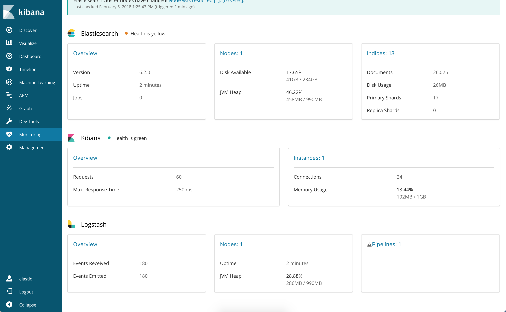

## X-Pack监控

要监视Logstash节点：

1. 确定监控数据的发送位置，通常是生产群集。有关典型监视架构的示例，请参阅 [监视工作原理](https://www.elastic.co/guide/en/elastic-stack-overview/6.7/how-monitoring-works.html)。

> **重要：**
> 要将Logstash可视化为Elastic Stack的一部分（如步骤6所示），请将性能指标发送到生产群集。专用监视集群接收到后，将显示监视集群下的Logstash性能。

2. 确定生产群集上的 `xpack.monitoring.collection.enabled` 是否设置为 `true`。如果该设置为 `false`，则性能监控数据集在Elasticsearch中不可用，并从所有来源中被忽略。
3. 配置Logstash节点，在 `logstash.yml中` 设置 `xpack.monitoring.elasticsearch.hosts` 使其发送性能指标。如果启用了X-Pack安全性，则还需要指定 [内置 `logstash_system` 用户](https://www.elastic.co/guide/en/elastic-stack-overview/6.7/built-in-users.html) 的凭据。有关这些设置的详细信息，请参阅 [监控设置](#监控设置)。

```yaml
xpack.monitoring.elasticsearch.hosts: ["http://es-prod-node-1:9200", "http://es-prod-node-2:9200"]  ①
xpack.monitoring.elasticsearch.username: "logstash_system"  ②
xpack.monitoring.elasticsearch.password: "changeme"
```

​	① 如果在生产群集上启用了SSL/TLS，则必须通过HTTPS进行连接。从v5.2.1开始，您可以以数组形式指定多个Elasticsearch主机，或以字符串形式指定单个主机。如果指定了多个URL，则Logstash可以将请求在这些生产节点上进行负载均衡。

​	② 如果在生产群集上禁用了X-Pack安全性，则可以省略这些 `username` 和 `password` 设置。

4. 如果在生产Elasticsearch集群上启用了SSL/TLS，请指定验证集群中节点标识的可信CA证书。

要将CA证书添加为Logstash节点的可信证书，您可以使用 `certificate_authority` 设置PEM编码证书的位置：

```yaml
xpack.monitoring.elasticsearch.ssl.certificate_authority: /path/to/ca.crt
```

或者，您可以使用信任库（包含证书的Java密钥库文件）配置受信任证书：

```yaml
xpack.monitoring.elasticsearch.ssl.truststore.path: /path/to/file
xpack.monitoring.elasticsearch.ssl.truststore.password: password
```

此外，您可以选择使用密钥库（包含证书的Java密钥库文件）设置客户端证书：

```yaml
xpack.monitoring.elasticsearch.ssl.keystore.path: /path/to/file
xpack.monitoring.elasticsearch.ssl.keystore.password: password
```

将sniffing设置为 `true` 以启用elasticsearch群集的节点发现功能。默认为 `false`。

```yaml
xpack.monitoring.elasticsearch.sniffing: false
```

5. 重新启动Logstash节点。
6. 要验证X-Pack监视配置，请使用浏览器访问Kibana地址，然后从侧边菜单选择 "Monitoring"。 Logstash区域显示Logstash节点的性能指标。启用安全性后，要查看监视仪表板，您必须以具有 `kibana_user` 和 `monitoring_user` 角色的用户身份登录Kibana。



#### 升级后重新启用监控

从旧版本的X-Pack升级时，出于安全原因，会禁用内置的 `logstash_system` 用户。如需要恢复监控，请 [更改密码并重新启用logstash_system用户](../14-Monitoring-Logstash/Troubleshooting.md#升级后监控失效)。

### 监控设置

您可以在 `logstash.yml` 中设置 `xpack.monitoring` 选项，以从Logstash节点收集监视数据。默认配置在大多数情况下能达到最佳效果。有关配置Logstash的更多信息，请参阅 [logstash.yml](../04-Setting-Up-and-Running-Logstash/logstash.yml.md)

#### 常用监控设置

`xpack.monitoring.enabled`

	默认情况下禁用监控。设置为 `true` 以启用X-Pack监控。
	
`xpack.monitoring.elasticsearch.hosts`

	将Logstash性能指标发送到的Elasticsearch实例。这可能与Logstash配置的 `outputs` 中指定的Elasticsearch实例相同，也可能使用其他实例。这不是专用于监控的集群URL。即使您使用的是专用监控集群，也必须通过生产集群路由Logstash指标。您可以使用字符串的形式指定单个主机，也可以用数组的形式指定多个主机。默认为`http://localhost:9200`。
	
`xpack.monitoring.elasticsearch.username` 和 `xpack.monitoring.elasticsearch.password`

	如果您的Elasticsearch受基本身份验证保护，则这些设置会提供Logstash实例进行身份验证的用户名和密码，用于传送监控数据。

#### 采集监控设置

`xpack.monitoring.collection.interval`

	控制在Logstash端收集和发送数据样本的频率。默认为10秒。如果修改采集时间间隔，请将 `kibana.yml` 中的 `xpack.monitoring.min_interval_seconds` 选项设置为相同的值。

#### X-Pack监控TLS/SSL设置

您可以配置以下传输层安全性（TLS）或安全套接字层（SSL）设置。 有关更多信息，请参阅为 [配置监控凭据](../06-Configuring-Logstash/X-Pack-security.md#配置监控凭据)。

`xpack.monitoring.elasticsearch.ssl.certificate_authority`

	可选设置，使您可以为Elasticsearch实例的证书颁发机构指定 `.pem` 文件的路径。
	
`xpack.monitoring.elasticsearch.ssl.truststore.path`

	可选设置，提供Java密钥库（JKS）的路径以验证服务器的证书。
	
`xpack.monitoring.elasticsearch.ssl.truststore.password`

	可选设置，为信任库提供密码。
	
`xpack.monitoring.elasticsearch.ssl.keystore.path`

	可选设置，提供Java密钥库（JKS）的路径以验证客户端的证书。
	
`xpack.monitoring.elasticsearch.ssl.keystore.password`

	可选设置，为密钥库设置密码。
