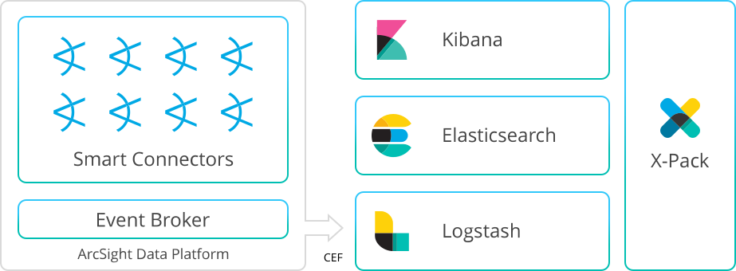
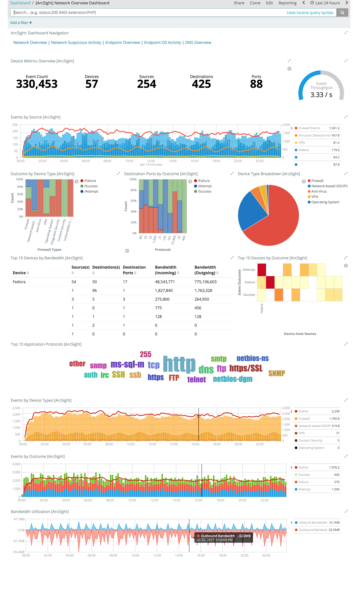
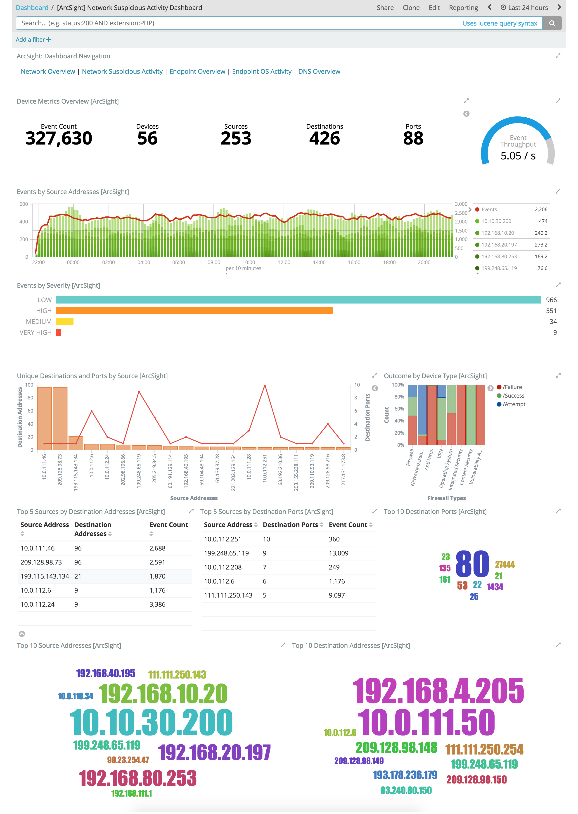

## ArcSight模块

> **注意：**
>
> Logstash ArcSight模块是基本许可证下的 [X-Pack](https://www.elastic.co/cn/products/stack) 功能，因此可以免费使用。如有任何疑问或更多信息，请联系 arcsight@elastic.co。

Logstash ArcSight模块使您可以轻松地将ArcSight数据与Elastic Stack集成。只需一个命令，模块就可以直接利用ArcSight Smart Connector或Event Broker，将安全事件解析并索引到Elasticsearch，并安装一套Kibana仪表板，让您立即进行数据探索。

### 准备工作

此处假定已经安装了Logstash，Elasticsearch和Kibana。您可以 [在此下载](https://www.elastic.co/downloads/) 和轻松安装。此模块需要Elastic Stack 5.6（或更高版本）和X-Pack。如果您使用的是Elastic Stack 6.2及更早版本，请参阅这些版本的 [说明](https://www.elastic.co/guide/en/logstash/6.2/arcsight-module.html)。

### 部署架构

Logstash ArcSight模块可理解CEF（公共事件格式），可以接受、丰富和索引这些事件，以便在Elastic Stack上进行分析。 ADP包含两个用于数据流的核心数据收集组件：

- Smart Connector（SC）是边缘日志收集器，可在发布到Logstash接收器之前对CEF进行数据解析和规范化。
- Event Broker是传入数据的中心枢纽，基于开源Apache Kafka。 Logstash ArcSight模块可以直接消耗Event Broker topic。

### Smart Connector入门
首先，您可以使用基本的Elastic Stack设置，直接从Smart Connector读取事件。
Smart Connector已配置为使用CEF syslog目标发布ArcSight数据（到TCP端口 `5000`）。

> **注意：**
> Logstash，Elasticsearch和Kibana必须在本地运行。请注意，您还可以在单独的主机上运行Elasticsearch，Kibana和Logstash，以使用ArcSight中的数据。

#### Smart Connector命令

1. 在Logstash安装目录中运行以下命令，使用相应的Smart Connector主机和端口来启动Logstash ArcSight模块：

```shell
bin/logstash --modules arcsight --setup \
  -M "arcsight.var.input.smartconnector.port=smart_connect_port"  \
  -M "arcsight.var.elasticsearch.hosts=localhost:9200"  \
  -M "arcsight.var.kibana.host=localhost:5601"
```

`--modules arcsight` 选项可以旋转一个支持ArcSight CEF的Logstash管道进行摄取。`--setup` 选项在Elasticsearch中创建 `arcsight- *` 索引匹配，并导入Kibana仪表板和可视化。在后续模块运行或扩展Logstash部署时，应省略 `--setup` 选项以避免覆盖现有Kibana仪表板。

有关详细信息，请参阅 [Logstash ArcSight模块配置项](#Logstash ArcSight模块配置项)。

2. Kibana探索数据：

   a. 打开浏览器@ [http://localhost:5601](http://localhost:5601/) （用户名："elastic"；密码："YOUR_PASSWORD"）
   b. 打开 **[ArcSight] 网络概述仪表板**
   c. 有关数据探索的其他详细信息，请参阅 [探索安全数据](#探索安全数据)。

如果要指定ArcSight模块其他选项，请参阅 [配置模块](#配置模块)。

### Event Broker入门
首先，您可以使用基本Elastic Stack设置，从Event Broker事件流中读取事件的。


默认情况下，Logstash ArcSight模块使用Event Broker 的 "eb-cef"主题。有关其他设置，请参阅 [Logstash ArcSight模块配置项](#Logstash ArcSight模块配置项)。还可以从安全的事件代理端口进行使用，请参阅 [Logstash ArcSight模块配置项](#Logstash ArcSight模块配置项)。

> 注意
> Logstash，Elasticsearch和Kibana必须在本地运行。请注意，您还可以在单独的主机上运行Elasticsearch，Kibana和Logstash以使用ArcSight中的数据。

#### Event Broker说明
1. 在Logstash安装目录中运行以下命令，使用相应的Event Broker主机和端口来启动Logstash ArcSight模块：

```shell
bin/logstash --modules arcsight --setup \
 -M "arcsight.var.input.eventbroker.bootstrap_servers=event_broker_host:event_broker_port"  \
 -M "arcsight.var.elasticsearch.hosts=localhost:9200"  \
 -M "arcsight.var.kibana.host=localhost:5601"
```

`--modules arcsight` 选项可以旋转一个支持ArcSight CEF的Logstash管道进行摄取。`--setup` 选项在Elasticsearch中创建 `arcsight- *` 索引匹配，并导入Kibana仪表板和可视化。在后续模块运行或扩展Logstash部署时，应省略 `--setup` 选项以避免覆盖现有Kibana仪表板。

有关详细信息，请参阅 [Logstash ArcSight模块配置项](#Logstash ArcSight模块配置项)。

2. Kibana探索数据：

   a. 打开浏览器@ [http://localhost:5601](http://localhost:5601/) （用户名："elastic"；密码："YOUR_PASSWORD"）
   b. 打开 **[ArcSight] 网络概述仪表板**
   c. 有关数据探索的其他详细信息，请参阅 [探索安全数据](#探索安全数据)。

如果要指定ArcSight模块其他选项，请参阅 [配置模块](#配置模块)。

### 探索安全数据

一旦Logstash ArcSight模块开始接收事件，您可立即使用打Kibana仪表板来探索和可视化安全数据。 仪表板可以提升安全分析师和操作员所需的时间和精力，以获得网络环境、端点和DNS的相关事件。 您可以按原有样式使用仪表板，也可以根据现有用例和业务需求对其进行定制。

仪表板有一个导航窗格，用于跨三个核心用例进行上下文切换和深入分析：

- **网络数据**
  - 仪表板：网络概述，网络可疑活动
  - 数据类型：网络防火墙，入侵系统，VPN设备

- 端点数据
  - 仪表板：端点概述，端点OS活动
  - 数据类型：操作系统，应用程序，主机入侵系统

- DNS数据
  - 仪表板：Microsoft DNS概述
  - 数据类型：Microsoft DNS设备

#### 网络仪表板示例





通过这些Kibana可视化，您可以快速了解顶级设备、端点、攻击者和目标。 这种洞察力以及即时深入挖掘特定主机、端口、设备或时间范围的能力，提供了环境的整体视图，以识别可能需要立即关注或采取行动的特定细节。 您可以轻松找到以下问题的答案：

- 谁是我的攻击者，他们的目标是什么？
- 我的哪些设备或端点最繁忙，哪些服务已释放？
- 在任何选中的时间点触发了多少的攻击者、技术、签名或目标？
- 导致故障数量增加的主要来源、目的地、协议和行为是什么？

### 配置模块

您可以在 `logstash.yml` 配置文件中为Logstash ArcSight模块指定其他选项，或者通过命令行覆盖。有关配置模块的更多信息，请参阅 [第8章-模块](../08-Working-with-Logstash-Modules/README.md)。

例如，可以将以下设置附加到 `logstash.yml` 以配置模块：

```yaml
modules:
  - name: arcsight
    var.input.eventbroker.bootstrap_servers: "eb_host:39092"
    var.input.eventbroker.topics: "eb_topic"
    var.elasticsearch.hosts: "localhost:9200"
    var.elasticsearch.username: "elastic"
    var.elasticsearch.password: "YOUR_PASSWORD"
    var.kibana.host: "localhost:5601"
    var.kibana.username: "elastic"
    var.kibana.password: "YOUR_PASSWORD"
```
#### Logstash ArcSight模块配置

ArcSight模块提供以下配置项，这些配置项包括ArcSight特有的配置项，以及所有Logstash模块支持的通用选项。

当使用命令行覆盖设置时，请记住在设置前添加模块名称，例如 `arcsight.var.inputs` 而不是 `var.inputs`。

如果未指定配置设置，Logstash将使用默认值。

##### 配置项清单

`var.inputs`

 - 值类型是 [String](../06-Configuring-Logstash/Structure-of-a-Config-File.md#String)

 - 默认值为"eventbroker"

   将输入暴露给Logstash ArcSight模块。可选值为"eventbroker"，"smartconnector"或"eventbroker,smartconnector"（同时暴露两个输入）。

##### ArcSight模块Event Broker特定选项

`var.input.eventbroker.bootstrap_servers`

- 值类型是 [String](../06-Configuring-Logstash/Structure-of-a-Config-File.md#String)

- 默认值为 "localhost:39092"\

  用于建立与群集的初始连接的Event Broker URL列表。此列表应采用 `host1:port1,host2:port2` 的形式。这些URL仅用于初始化连接，以发现完整的集群成员资格（可能会动态更改）。此列表不需要包含完整的服务器集。（您可能需要多个，以避免某些服务器可能不在线。）

`var.input.eventbroker.topics`

- 值类型是 [Array](../06-Configuring-Logstash/Structure-of-a-Config-File.md#Array)

- 默认值为 ["eb-cef"]

  要订阅的Event Broker topic列表。

`var.input.eventbroker.security_protocol`

- 值可以是以下任何值：PLAINTEXT，SSL，SASL_PLAINTEXT，SASL_SSL

- 默认值为"PLAINTEXT"

  要使用的安全协议，可以是PLAINTEXT，SSL，SASL_PLAINTEXT，SASL_SSL。如果指定除PLAINTEXT以外的任何内容，则还需要指定下面列出的一些选项。在指定 `SSL` 或 `SASL_SSL` 时，您应该为前缀为 `ssl_` 的选项提供值，在指定 `SASL_PLAINTEXT` 或 `SASL_SSL` 时，您应该为 `jaas_path`，`kerberos_config`，`sasl_mechanism` 和 `sasl_kerberos_service_name` 提供值。

`var.input.eventbroker.ssl_key_password`

- 值类型是 [Password](../06-Configuring-Logstash/Structure-of-a-Config-File.md#Password)

- 此设置没有默认值。

  密钥库文件中私钥的密码。

`var.input.eventbroker.ssl_keystore_location`

- 值类型是 [Path](../06-Configuring-Logstash/Structure-of-a-Config-File.md#Path)

- 此设置没有默认值。

  如果需要客户端身份验证，则此设置是存储密钥库路径。

`var.input.eventbroker.ssl_keystore_password`

- 值类型是 [Password](../06-Configuring-Logstash/Structure-of-a-Config-File.md#Password)

- 此设置没有默认值。

  如果需要客户端身份验证，则此设置存储密钥库密码。

`var.input.eventbroker.ssl_keystore_type`

- 值类型是 [String](../06-Configuring-Logstash/Structure-of-a-Config-File.md#String)

- 此设置没有默认值。

  密钥库类型。

`var.input.eventbroker.ssl_truststore_location`

- 值类型是 [Path](../06-Configuring-Logstash/Structure-of-a-Config-File.md#Path)

- 此设置没有默认值。

  用于验证Kafka broker证书的JKS信任库路径。

`var.input.eventbroker.ssl_truststore_password`

- 值类型是 [Password](../06-Configuring-Logstash/Structure-of-a-Config-File.md#Password)

- 此设置没有默认值。

  信任库密码。

`var.input.eventbroker.ssl_truststore_type`

- 值类型是 [String](../06-Configuring-Logstash/Structure-of-a-Config-File.md#String)

- 此设置没有默认值。

  信任库类型。

`var.input.eventbroker.sasl_kerberos_service_name`

- 值类型是 [String](../06-Configuring-Logstash/Structure-of-a-Config-File.md#String)

- 此设置没有默认值。

  Kafka broker运行的Kerberos主体名称。这可以在Kafka的JAAS配置或Kafka的配置中定义。

`var.input.eventbroker.sasl_mechanism`

- 值类型是 [String](../06-Configuring-Logstash/Structure-of-a-Config-File.md#String)

- 默认值为"GSSAPI"

  用于客户端连接的SASL机制。这可以是安全提供者可用的任何机制。 GSSAPI是默认机制。

`var.input.eventbroker.jaas_path`

- 值类型是 [Path](../06-Configuring-Logstash/Structure-of-a-Config-File.md#Path)

- 此设置没有默认值。

  Java身份验证和授权服务（JAAS）API为Kafka提供用户身份验证和授权服务。此设置提供JAAS文件的路径。 Kafka客户端的示例JAAS文件：

```java
KafkaClient {
  com.sun.security.auth.module.Krb5LoginModule required
  useTicketCache=true
  renewTicket=true
  serviceName="kafka";
  };
```

请注意，在此处指定jaas_path和kerberos_config会将这些添加到全局JVM系统属性中。这意味着如果您有多个Kafka输入，则所有这些输入将共享相同的jaas_path和kerberos_config。如果不希望这样，则必须在不同的JVM实例上运行单独的Logstash实例。

`var.input.eventbroker.kerberos_config`

- 值类型是 [Path](../06-Configuring-Logstash/Structure-of-a-Config-File.md#Path)

- 此设置没有默认值。

  kerberos配置文件的可选路径。这是krb5.conf样式，详见https://web.mit.edu/kerberos/krb5-1.12/doc/admin/conf_files/krb5_conf.html

##### ArcSight Smart Connector选项

`var.input.smartconnector.port`

- 值类型是 [Number](../06-Configuring-Logstash/Structure-of-a-Config-File.md#Number)

- 默认值为5000

  从SC接收数据时要侦听的TCP端口。

`var.input.smartconnector.ssl_enable`

- 值类型是 [Boolean](../06-Configuring-Logstash/Structure-of-a-Config-File.md#Boolean)

- 默认值为 `false`

  启用SSL（必须设置其他ssl_选项才能生效）。

`var.input.smartconnector.ssl_cert`

- 值类型是 [Path](../06-Configuring-Logstash/Structure-of-a-Config-File.md#Path)

- 此设置没有默认值。

  SSL证书路径。

`var.input.smartconnector.ssl_extra_chain_certs`

- 值类型是 [Array](../06-Configuring-Logstash/Structure-of-a-Config-File.md#Array)
- 默认值为 `[]`
  要添加到证书链的额外X509证书的路径数组。在系统存储中不需要CA链时很有用。

`var.input.smartconnector.ssl_key`

- 值类型是 [Path](../06-Configuring-Logstash/Structure-of-a-Config-File.md#Path)

- 此设置没有默认值。

  SSL密钥路径

`var.input.smartconnector.ssl_key_passphrase`

- 值类型是 [Password](../06-Configuring-Logstash/Structure-of-a-Config-File.md#Path)

- 默认值为 `nil`

  SSL密钥密码

`var.input.smartconnector.ssl_verify`

- 值类型是 [Boolean](../06-Configuring-Logstash/Structure-of-a-Config-File.md#Boolean)

- 默认值为 `true`

  验证针对CA的SSL连接另一端的标识。 对于输入，将字段sslsubject设置为客户端证书的字段。

##### 通用配置项

以下是所有模块都支持的通用配置项：

`var.elasticsearch.hosts`

- 值类型是 [URI](../06-Configuring-Logstash/Structure-of-a-Config-File.md#URI)

- 默认值为 `"localhost:9200"`

  设置Elasticsearch集群的主机。对于每个主机，您必须指定主机名和端口。例如，"myhost:9200"。如果给定一个 [Array](../06-Configuring-Logstash/Structure-of-a-Config-File.md#Array)，Logstash将在hosts参数中指定的主机上加载平衡请求。从主机列表中排除 [专用主节点](https://www.elastic.co/guide/en/elasticsearch/reference/6.7/modules-node.html) 非常重要，以防止Logstash向主节点发送批量请求。因此，此参数应仅引用Elasticsearch中的数据或客户端节点

  这里的URL中出现的任何特殊字符必须是URL转义！这意味着 `＃` 应该以 `％23` 的形式输入。

`var.elasticsearch.username`

- 值类型是 [String](../06-Configuring-Logstash/Structure-of-a-Config-File.md#String)

- 默认值是"elastic"

  向Elasticsearch集群进行身份验证的用户名。

`var.elasticsearch.password`

- 值类型是 [String](../06-Configuring-Logstash/Structure-of-a-Config-File.md#String)

- 默认值为"changeme"

  向Elasticsearch集群进行身份验证的密码。

`var.elasticsearch.ssl.enabled`

- 值类型是 [Boolean](../06-Configuring-Logstash/Structure-of-a-Config-File.md#Boolean)

- 此设置没有默认值。

  启用与Elasticsearch集群的SSL / TLS安全通信。保留此未指定将使用在 `hosts` 中列出的URL中指定的任何方案。如果未指定显式协议，则将使用纯HTTP。如果此处明确禁用了SSL，则在主机中提供HTTPS URL时，插件将拒绝启动。

`var.elasticsearch.ssl.verification_mode`

- 值类型是 [String](../06-Configuring-Logstash/Structure-of-a-Config-File.md#String)

- 默认值是"strict"

  与Elasticsearch通信时的主机名验证设置。设置为 `disable` 以关闭主机名验证。禁用此功能存在严重的安全问题。

`var.elasticsearch.ssl.certificate_authority`

- 值类型是 [String](../06-Configuring-Logstash/Structure-of-a-Config-File.md#String)

- 此设置没有默认值

  与Elasticsearch通信时用于验证SSL证书的X.509证书的路径。

`var.elasticsearch.ssl.certificate`

- 值类型是 [String](../06-Configuring-Logstash/Structure-of-a-Config-File.md#String)

- 此设置没有默认值

  与Elasticsearch通信时用于客户端身份验证的X.509证书的路径。

`var.elasticsearch.ssl.key`

- 值类型是 [String](../06-Configuring-Logstash/Structure-of-a-Config-File.md#String)

- 此设置没有默认值

  与Elasticsearch通信时用于客户端身份验证的证书密钥的路径。

`var.kibana.host`

- 值类型是 [String](../06-Configuring-Logstash/Structure-of-a-Config-File.md#String)

- 默认值为 "localhost:5601"

  设置用于导入仪表板和可视化的Kibana实例的主机名和端口。例如： "myhost:5601"。

`var.kibana.scheme`

- 值类型是 [String](../06-Configuring-Logstash/Structure-of-a-Config-File.md#String)

- 默认值为"http"

  设置用于到达Kibana实例的协议。选项包括："http"或"https"。默认值为"http"。

`var.kibana.username`

- 值类型是 [String](../06-Configuring-Logstash/Structure-of-a-Config-File.md#String)

- 默认值是"elastic"

  用于对安全的Kibana实例进行身份验证的用户名。

`var.kibana.password`

- 值类型是 [String](../06-Configuring-Logstash/Structure-of-a-Config-File.md#String)

- 默认值为"changeme"

  用于向安全Kibana实例进行身份验证的密码。

`var.kibana.ssl.enabled`

- 值类型是 [Boolean](../06-Configuring-Logstash/Structure-of-a-Config-File.md#String)

- 默认值为false

  启用与Kibana实例的SSL/TLS安全通信。

`var.kibana.ssl.verification_mode`

- 值类型是 [String](../06-Configuring-Logstash/Structure-of-a-Config-File.md#String)

- 默认值是"strict"

  与Kibana通信时的主机名验证设置。设置为禁用以关闭主机名验证。禁用此功能存在严重的安全问题。

`var.kibana.ssl.certificate_authority`

- 值类型是 [String](../06-Configuring-Logstash/Structure-of-a-Config-File.md#String)

- 此设置没有默认值

  与Kibana通信时用于验证SSL证书的X.509证书的路径。

`var.kibana.ssl.certificate`

- 值类型是 [String](../06-Configuring-Logstash/Structure-of-a-Config-File.md#String)

- 此设置没有默认值

  与Kibana通信时用于客户端身份验证的X.509证书的路径。

`var.kibana.ssl.key`

- 值类型是 [String](../06-Configuring-Logstash/Structure-of-a-Config-File.md#String)

- 此设置没有默认值

  与Kibana通信时用于客户端身份验证的证书密钥的路径。
