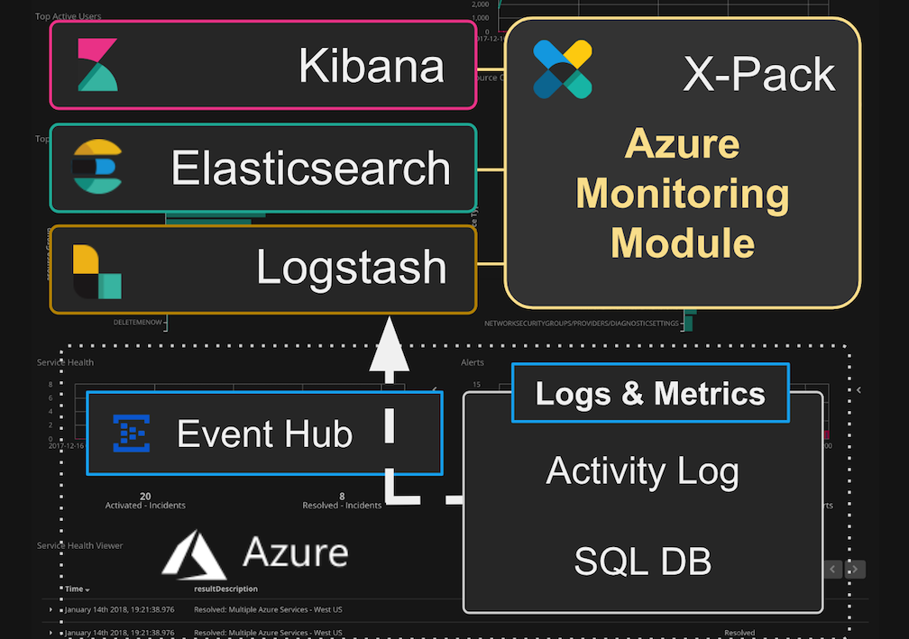

## Azure模块

> **警告：**
>
> 此功能是实验性的，在将来的版本中可能完全更改或删除。Elastic将尽最大努力解决问题，但实验性功能不受官方GA功能的支持SLA的约束。

Logstash中的 [Microsoft Azure](https://azure.microsoft.com/en-us/overview/what-is-azure/) 模块，可帮助您轻松地将Azure活动日志和SQL诊断日志与Elastic Stack集成。



您可以通过深入观察多个Azure订阅，来监控Azure云环境和SQL数据库部署。您可以实时探索基础架构的运行状况，加速分析根本原因，并缩短问题解决的时间。 Azure模块可以帮助您：

- 分析基础架构更改和授权活动
- 识别可疑行为和潜在的恶意行为者
- 通过调查用户活动来执行根本原因分析
- 监视和优化SQL DB部署。

> **注意：**
> Logstash Azure模块是基本许可证下的 [X-Pack](https://www.elastic.co/cn/products/stack) 功能，因此可以免费使用。如有任何疑问或更多信息，请联系monitor-azure@elastic.co。

Azure模块使用 [Logstash Azure Event Hub 输入插件](../17-Input-plugins/azure_event_hubs.md) 来使用Azure Event Hub的数据。该模块直接链接Azure仪表板，将事件解析并索引到Elasticsearch，并安装一套Kibana仪表板，以帮助您立即开始探索数据。

### 仪表板

您可以按原样使用Kibana仪表板，也可以根据您的需要定制它们。

#### 基础设施活动监测

- **Overview**。 Azure操作的顶级视图，包括有关用户，资源组，服务运行状况，访问，活动和警报的信息。
- **Alert**。警报信息，包括活动，警报状态和警报热图
- **User Activity**。有关系统用户，其活动和请求的信息。

#### SQL数据库监测

- **SQL DB Overview**。 SQL数据库的顶级视图，包括数据库，服务器，资源组和订阅的计数。
- **SQL DB Database View**。有关每个SQL数据库的详细信息，包括等待时间，错误，DTU和存储利用率，大小以及读写输入/输出。
- **SQL DB Queries**。有关SQL数据库查询和性能的信息。

### 准备工作

此模块需要使用Azure Event Hub和Elastic Stack。

#### Elastic准备工作

以下假设您已在本地运行Logstash，Elasticsearch和Kibana，也可以在不同的服务器上运行他们。

此模块需要Elastic Stack版本6.4（或更高版本）。

Azure模块使用 `azure_event_hubs` 输入插件来接收Azure环境中的日志和指标。它默认安装在Logstash 6.4（或更高版本）中。在设置Azure模块时，必须对插件和选项有基本了解。有关更多信息，请参阅 [Logstash Azure Event Hub 输入插件](../17-Input-plugins/azure_event_hubs.md) 。

Elastic产品 [在此下载](https://www.elastic.co/cn/downloads/) 并安装。

#### Azure准备工作

应配置Azure监视器将日志流式传输到一个或多个Event Hub。 Logstash将访问这些Event Hubs实例以使用Azure日志和指标。有关Microsoft Azure文档的链接，请参阅本主题末尾的 [Microsoft Azure资源](#Microsoft_Azure资源)。

### 配置模块

在 `logstash.yml` 中指定Logstash Azure模块的 [配置项](#配置项)。

- **基本配置**。您可以使用 `logstash.yml` 配置来自多个使用相同配置的Event Hub的输入。大多数情况下，建议使用基本配置。
- **高级配置**。当多个Event Hub使用不同配置时，可通过高级配置进行部署。仍在`logstash.yml `进行配置，不过大多数情况下，不需要或者说不建议进行高级配置。

有关基本和高级配置模型的更多信息，请参阅 [Logstash Azure Event Hub 输入插件](../17-Input-plugins/azure_event_hubs.md) 。

#### 基本配置示例

`logstash.yml` 中的配置在各Event Hub之间共享。对于大多数用例，建议使用基本配置：

```yaml
modules:
  - name: azure
    var.elasticsearch.hosts: localhost:9200
    var.kibana.host: localhost:5601
    var.input.azure_event_hubs.consumer_group: "logstash" 	①
    var.input.azure_event_hubs.storage_connection: "DefaultEndpointsProtocol=https;AccountName=instance1..." 	②
    var.input.azure_event_hubs.threads: 9 	③
    var.input.azure_event_hubs.event_hub_connections:
      - "Endpoint=sb://...EntityPath=insights-operational-logs" 	④
      - "Endpoint=sb://...EntityPath=insights-metrics-pt1m" 	⑤
      - "Endpoint=sb://...EntityPath=insights-logs-blocks"
      - "Endpoint=sb://...EntityPath=insights-logs-databasewaitstatistics"
      - "Endpoint=sb://...EntityPath=insights-logs-errors"
      - "Endpoint=sb://...EntityPath=insights-logs-querystoreruntimestatistics"
      - "Endpoint=sb://...EntityPath=insights-logs-querystorewaitstatistics"
      - "Endpoint=sb://...EntityPath=insights-logs-timeouts"
```

 强烈建议使用 `consumer_group`（可选）。 请参阅 [最佳实践](#最佳实践)。

 当扩展具有多个Logstash实例的部署时，`storage_connection`（可选）设置Azure Blob存储连接以跟踪Event Hub的处理状态。 有关其他详细信息，请参阅 [扩展Event Hub](#扩展Event_Hub消费)。

 有关选择适当线程数，请参阅 [最佳实践](#最佳实践)。

 此连接设置活动日志的消耗。 默认情况下，Azure监视器使用的Event Hub名称为 `insights-operational-logs`。 确保这与活动日志指定的Event Hub的名称相匹配。

 这个以及下面的连接设置SQL DB诊断日志和指标的消耗。 默认情况下，Azure Monitor使用所有这些不同的Event Hub名称。

基本配置需要 `var.input.azure_event_hubs`。 配置选项前缀。 请注意 `threads` 选项的表达式。

#### 高级配置示例

`logstash.yml` 中的高级配置支持Event Hub特定选项。高级配置可用于跨多个Event Hub，更精细地调整线程和Blob存储使用。 大多数情况下不需要或建议进行高级配置。 仅在部署方案需要时才使用。

您必须在最开始的位置定义 `name` 的 `header` 数组。您可以按任何顺序定义其他选项。 各Event Hub个性化的配置内容优先级较高，未配置值使用全局配置值。

在此示例中，`threads`、`consumer_group` 和 `storage_connection` 将应用于每个已配置的Event Hub。 请注意，`decorate_events` 在全局和每个Event Hub配置中定义。 每个Event Hub配置优先级高，当每个Event Hub都设置后，全局配置实际上就无用了。

```yaml
modules:
  - name: azure
    var.elasticsearch.hosts: localhost:9200
    var.kibana.host: localhost:5601
    var.input.azure_event_hubs.decorate_events: true ①
    var.input.azure_event_hubs.threads: 9 ②
    var.input.azure_event_hubs.consumer_group: "logstash"
    var.input.azure_event_hubs.storage_connection: "DefaultEndpointsProtocol=https;AccountName=instance1..."
    var.input.azure_event_hubs.event_hubs:
      - ["name", "initial_position", "storage_container", "decorate_events", "event_hub_connection"]  ③
      - ["insights-operational-logs", "TAIL", "activity-logs1", "true", "Endpoint=sb://...EntityPath=insights-operational-logs"]
      - ["insights-operational-logs", "TAIL", "activity_logs2",  ④  "true", "Endpoint=sb://...EntityPath=insights-operational-logs"]
      - ["insights-metrics-pt1m", "TAIL", "dbmetrics", "true",             "Endpoint=sb://...EntityPath=insights-metrics-pt1m"]
      - ["insights-logs-blocks", "TAIL", "dbblocks", "true", "Endpoint=sb://...EntityPath=insights-logs-blocks"]
      - ["insights-logs-databasewaitstatistics", "TAIL", "dbwaitstats", "false", "Endpoint=sb://...EntityPath=insights-logs-databasewaitstatistics"]
      - ["insights-logs-errors", "HEAD", "dberrors", "true", "Endpoint=sb://...EntityPath=insights-logs-errors"
      - ["insights-logs-querystoreruntimestatistics", "TAIL", "dbstoreruntime", "true", "Endpoint=sb://...EntityPath=insights-logs-querystoreruntimestatistics"]
      - ["insights-logs-querystorewaitstatistics", "TAIL", "dbstorewaitstats", "true", "Endpoint=sb://...EntityPath=insights-logs-querystorewaitstatistics"]
      - ["insights-logs-timeouts", "TAIL", "dbtimeouts", "true", "Endpoint=sb://...EntityPath=insights-logs-timeouts"]
```

 您可以指定全局Event Hub选项。它们将被event_hubs选项中指定的对应配置覆盖。

 有关选择适当线程数的指导，请参阅 [最佳实践](#最佳实践)。

 必须在最开始的位置定义 `name` 的 `header` 数组。 其他选项可以按任何顺序定义。 各Event Hub个性化的配置内容优先级较高，未配置值使用全局配置值。

 这允许从使用不同Blob存储容器的第二个活动日志Event Hub进行消费。 这是必要的，以避免第一个 insights-operational-logs 的偏移覆盖第二个 insights-operational-logs 的偏移。

各Event Hub配置选项中，高级配置不需要加前缀。 请注意 `initial_position` 选项的表示法。

####  扩展Event Hub消费

 [Azure Blob Storage account](https://azure.microsoft.com/en-us/services/storage/blobs) 是Azure-to-Logstash配置的重要组成部分，这是用户横向扩展Logstash实例数量时，从Event Hub消费时的必须内容。

Blob存储帐户是多个Logstash实例一起处理事件的核心。它记录已处理事件的偏移量（位置）。Logstash重启后，会从中断处继续处理。

配置说明：

- 强烈建议将Blob Storage帐户与此模块一起使用，这可能是生产服务器所必需的。
- `storage_connection` 选项传递blob存储连接字符串。
- 配置所有Logstash实例使用相同的 `storage_connection` 来获得共享处理的优点。

Blob存储连接字符串示例：

```
DefaultEndpointsProtocol=https;AccountName=logstash;AccountKey=ETOPnkd/hDAWidkEpPZDiXffQPku/SZdXhPSLnfqdRTalssdEuPkZwIcouzXjCLb/xPZjzhmHfwRCGo0SBSw==;EndpointSuffix=core.windows.net
```

在此处找到Blob Storage的连接字符串：[Azure Portal](https://portal.azure.com/)`-> Blob Storage account -> Access keys`。

#### 最佳实践

以下是一些实现成功部署的原则，并避免数据冲突导致丢失事件。

- **创建Logstash消费者组**。专门为Logstash创建一个新的使用者组。请勿使用 $default 或可能已在使用的任何其他使用者组。在无关消费者中重复使用消费者群体，可能导致意外行为并丢失事件。所有Logstash实例都应使用相同的使用者组，以便它们一起处理事件。
- **避免使用多个Event Hub覆盖偏移量**。Event Hub的偏移量（位置）存储在配置的Azure Blob存储中。 Azure Blob存储使用文件系统之类的路径来存储偏移量。如果多个Event Hub之间的路径重叠，则偏移可能存储不正确。要避免重复的文件路径，请使用高级配置模型，并确保每个Event Hub至少有一个选项不同：
  - storage_connection
  - storage_container（如果未定义，则默认为Event Hub名称）
  - consumer_group
- **正确设置线程数**。线程数应等于Event Hub数加一（或更多）。每个Event Hub至少需要一个线程。需要一个额外的线程来帮助协调其他线程。线程数不应超过Event Hub数乘以每个Event Hub的分区数加1。线程目前仅作为全局设置使用。
  - 示例：Event Hub= 4，每个Event Hub的分区= 3，最小线程数为5（4个Event Hub加一个）。最大线程数为13（4个Event Hub数乘以3个分区加1个）。
  - 如果您只从一个指定的Event Hub实例收集活动日志，则只需要2个线程（1个Event Hub加1个）。

### 设置并运行模块

确保 [正确配置](#配置模块) 了logstash.yml文件。

#### 第一次设置
从Logstash目录运行此命令：

```shell
bin/logstash --setup
```

`--modules azure` 选项启动Logstash管道，以从AzureEvent Hub提取。`--setup`选项在Elasticsearch中创建 `azure- *` 索引匹配，并导入Kibana仪表板和可视化。

#### 启动

从Logstash目录运行此命令：

```shell
bin/logstash
```

> **注意：**
> --setup选项仅适用于首次设置。如果在后续运行中包含--setup，则将覆盖现有的Kibana仪表板。

### 探索数据

当Logstash Azure模块开始接收事件时，您可以使用Kibana仪表板来浏览和可视化您的数据。

要使用Kibana探索您的数据：

- 打开浏览器 http://localhost:5601 （用户名："elastic"，密码："YOUR_PASSWORD"）
- 单击 **Dashboard**。
- 单击 **[Azure Monitor] Overview**。

### 配置项

> **注意：**
>
> 所有Event Hub选项都通用于基本配置和高级配置，但以下情况除外。基本配置使用 `event_hub_connections` 来支持多个连接。高级配置使用 `event_hubs` 和 `event_hub_connection`（单数）。

**`event_hubs`**

- 值类型是 [Array](../06-Configuring-Logstash/Structure-of-a-Config-File.md#array)

- 没有默认值

- 忽略基本和命令行配置

- 需要高级配置

  为 [高级配置](#高级配置示例) 定义每个Event Hub配置。

高级配置使用 `event_hub_connection` 而不是 `event_hub_connections`。 `event_hub_connection` 选项是各Event Hub分别定义的。

**`event_hub_connections`**

- 值类型是 [Array](../06-Configuring-Logstash/Structure-of-a-Config-File.md#array)

- 没有默认值

- 基本和命令行配置必需

- 忽略高级配置

  标识要读取的Event Hub的连接字符串列表。连接字符串包括Event Hub的EntityPath。

**`checkpoint_interval`**

- 值类型是 [Number](../06-Configuring-Logstash/Structure-of-a-Config-File.md#number)
- 默认值为5秒
- 设置为0以禁用。
  批处理期间写入检查点的时间间隔（以秒为单位）。检查点告诉Logstash重启后恢复处理的位置。无论此设置如何，都会在每批次结束时自动写入检查点。

过于频繁地编写检查点会不必要地减慢处理速度。

**`consumer_group`**

- 值类型是 [String](../06-Configuring-Logstash/Structure-of-a-Config-File.md#string)
- 默认值为 `$Default`
- 消费者组用于阅读Event Hub。专门为Logstash创建一个使用者组。然后确保Logstash的所有实例都使用该使用者组，以便它们可以正常工作。

**`decorate_events`**

- 值类型是 [Boolean](../06-Configuring-Logstash/Structure-of-a-Config-File.md#number)
- 默认值为false
- 添加有关Event Hub的元数据，包括 `Event Hub name`、`consumer_group`、`processor_host`、`partition`、`offset`、`sequence`、`timestamp`和 `event_size`。

**`initial_position`**

- 值类型是 [String](../06-Configuring-Logstash/Structure-of-a-Config-File.md#string)

- 有效参数是 `beginning`、 `end`、`look_back`

- 默认值 `beginning`

  首次从Event Hub读取时，从此位置开始：

- `beginning` 读取Event Hub中所有预先存在的事件

- `end` 不会读取Event Hub中任何预先存在的事件

- `look_back` 读取 `end` 减去预先存在的事件的秒数。您可以使用 `initial_position_look_back` 选项控制秒数。

  如果设置了 `storage_connection`，则仅在Logstash首次从Event Hub读取时使用 `initial_position` 值。

**`initial_position_look_back`**

- 值类型是 [Number](../06-Configuring-Logstash/Structure-of-a-Config-File.md#number)

- 默认值为 `86400`

- 仅在 `initial_position` 设置为 `look-back` 时使用

  回顾以查找预先存在的事件的初始位置的秒数。仅当 `initial_position` 设置为 `look_back` 时才使用此选项。如果设置了 `storage_connection`，则此配置仅在Logstash首次从Event Hub读取时应用。

**`max_batch_size`**

- 值类型是 [Number](../06-Configuring-Logstash/Structure-of-a-Config-File.md#number)

- 默认值为 `125`

  一起检索和处理的最大事件数。每批后都会创建一个检查点。增加此值可能有助于提高性能，但需要更多内存。

**`storage_connectionedi`**

- 值类型是 [String](../06-Configuring-Logstash/Structure-of-a-Config-File.md#string)

- 没有默认值

  blob帐户存储的连接字符串。 Blob帐户存储在重新启动之间持续存在偏移，并确保Logstash的多个实例处理不同的分区。设置此值后，重新开始继续处理停止的位置。如果未设置此值，则每次重新启动时都会使用 `initial_position` 值。

  我们强烈建议您为生产环境定义此值。

**`storage_container`**

- 值类型是 [String](../06-Configuring-Logstash/Structure-of-a-Config-File.md#string)

- 如果未定义，则默认为Event Hub名称

  用于保留偏移量并允许多个Logstash实例一起工作的存储容器的名称。

  为避免覆盖偏移量，您可以使用不同的存储容器。如果要监视两个具有相同名称的Event Hub，这一点尤为重要。您可以使用高级配置模型配置不同的存储容器。

**`threads`**

- 值类型是 [Number](../06-Configuring-Logstash/Structure-of-a-Config-File.md#number)

- 最小值为 `2`

- 默认值为 `4`

  用于处理事件的线程总数。 您在此处设置的值适用于所有事件中心。 即使使用高级配置，此值也是全局设置，无法为每个事件中心设置。

  线程数应该是事件中心的数量加上一个或多个。 有关更多信息，请参阅最佳做法

##### 通用配置项

以下是所有模块都支持的通用配置项。

`var.elasticsearch.hosts`

- 值类型是 [URI](../06-Configuring-Logstash/Structure-of-a-Config-File.md#uri)

- 默认值为 `"localhost:9200"`

  设置Elasticsearch集群的主机。对于每个主机，您必须指定主机名和端口。例如，"myhost:9200"。如果给定一个 [Array](../06-Configuring-Logstash/Structure-of-a-Config-File.md#array)，Logstash将在hosts参数中指定的主机上加载平衡请求。从主机列表中排除 [专用主节点](https://www.elastic.co/guide/en/elasticsearch/reference/6.7/modules-node.html) 非常重要，以防止Logstash向主节点发送批量请求。因此，此参数应仅引用Elasticsearch中的数据或客户端节点

  这里的URL中出现的任何特殊字符必须是URL转义！这意味着 `＃` 应该以 `％23` 的形式输入。

`var.elasticsearch.username`

- 值类型是 [String](../06-Configuring-Logstash/Structure-of-a-Config-File.md#string)

- 默认值是"elastic"

  向Elasticsearch集群进行身份验证的用户名。

`var.elasticsearch.password`

- 值类型是 [String](../06-Configuring-Logstash/Structure-of-a-Config-File.md#string)

- 默认值为"changeme"

  向Elasticsearch集群进行身份验证的密码。

`var.elasticsearch.ssl.enabled`

- 值类型是 [Boolean](../06-Configuring-Logstash/Structure-of-a-Config-File.md#boolean)

- 此设置没有默认值。

  启用与Elasticsearch集群的SSL / TLS安全通信。保留此未指定将使用在 `hosts` 中列出的URL中指定的任何方案。如果未指定显式协议，则将使用纯HTTP。如果此处明确禁用了SSL，则在主机中提供HTTPS URL时，插件将拒绝启动。

`var.elasticsearch.ssl.verification_mode`

- 值类型是 [String](../06-Configuring-Logstash/Structure-of-a-Config-File.md#string)

- 默认值是"strict"

  与Elasticsearch通信时的主机名验证设置。设置为 `disable` 以关闭主机名验证。禁用此功能存在严重的安全问题。

`var.elasticsearch.ssl.certificate_authority`

- 值类型是 [String](../06-Configuring-Logstash/Structure-of-a-Config-File.md#string)

- 此设置没有默认值

  与Elasticsearch通信时用于验证SSL证书的X.509证书的路径。

`var.elasticsearch.ssl.certificate`

- 值类型是 [String](../06-Configuring-Logstash/Structure-of-a-Config-File.md#string)

- 此设置没有默认值

  与Elasticsearch通信时用于客户端身份验证的X.509证书的路径。

`var.elasticsearch.ssl.key`

- 值类型是 [String](../06-Configuring-Logstash/Structure-of-a-Config-File.md#string)

- 此设置没有默认值

  与Elasticsearch通信时用于客户端身份验证的证书密钥的路径。

`var.kibana.host`

- 值类型是 [String](../06-Configuring-Logstash/Structure-of-a-Config-File.md#string)

- 默认值为 "localhost:5601"

  设置用于导入仪表板和可视化的Kibana实例的主机名和端口。例如： "myhost:5601"。

`var.kibana.scheme`

- 值类型是 [String](../06-Configuring-Logstash/Structure-of-a-Config-File.md#string)

- 默认值为"http"

  设置用于到达Kibana实例的协议。选项包括："http"或"https"。默认值为"http"。

`var.kibana.username`

- 值类型是 [String](../06-Configuring-Logstash/Structure-of-a-Config-File.md#string)

- 默认值是"elastic"

  用于对安全的Kibana实例进行身份验证的用户名。

`var.kibana.password`

- 值类型是 [String](../06-Configuring-Logstash/Structure-of-a-Config-File.md#string)

- 默认值为"changeme"

  用于向安全Kibana实例进行身份验证的密码。

`var.kibana.ssl.enabled`

- 值类型是 [Boolean](../06-Configuring-Logstash/Structure-of-a-Config-File.md#string)

- 默认值为false

  启用与Kibana实例的SSL/TLS安全通信。

`var.kibana.ssl.verification_mode`

- 值类型是 [String](../06-Configuring-Logstash/Structure-of-a-Config-File.md#string)

- 默认值是"strict"

  与Kibana通信时的主机名验证设置。设置为禁用以关闭主机名验证。禁用此功能存在严重的安全问题。

`var.kibana.ssl.certificate_authority`

- 值类型是 [String](../06-Configuring-Logstash/Structure-of-a-Config-File.md#string)

- 此设置没有默认值

  与Kibana通信时用于验证SSL证书的X.509证书的路径。

`var.kibana.ssl.certificate`

- 值类型是 [String](../06-Configuring-Logstash/Structure-of-a-Config-File.md#string)

- 此设置没有默认值

  与Kibana通信时用于客户端身份验证的X.509证书的路径。

`var.kibana.ssl.key`

- 值类型是 [String](../06-Configuring-Logstash/Structure-of-a-Config-File.md#string)

- 此设置没有默认值

  与Kibana通信时用于客户端身份验证的证书密钥的路径。

### Azure模块架构

此模块从Azure事件中心读取数据，并为活动日志和SQL诊断的数据添加一些其他结构。原始数据始终保留，添加或解析的任何数据都将在azure下命名。例如，`azure.subscription` 可能已经从更复杂的URN中解析出来。

| 名称                      | 描述                           | 备注                                  |
| ------------------------- | ------------------------------ | ------------------------------------- |
| azure.subscription        | 此数据源自的Azure订阅。        | 某些活动日志事件可能与订阅无关。      |
| azure.group               | 主要数据类型。                 | 当前值为activity_log或sql_diagnostics |
| azure.category*           | 指定发起数据的组的辅助数据类型 |                                       |
| azure.provider            | Azure提供商                    |                                       |
| azure.resource_group      | Azure资源组                    |                                       |
| azure.resource_type       | Azure资源类型                  |                                       |
| azure.resource_name       | Azure资源名称                  |                                       |
| azure.database            | Azure数据库名称，用于显示目的  | 仅限SQL诊断程序                       |
| azure.db_unique_id        | 保证唯一的Azure数据库名称      | 仅限SQL诊断程序                       |
| azure.server              | 数据库的Azure服务器            | 仅限SQL诊断程序                       |
| azure.server_and_database | Azure服务器和数据库相结合      | 仅限SQL诊断程序                       |

注意：

- 活动日志可以具有以下类别： Administrative, ServiceHealth, Alert, Autoscale, Security
- SQL诊断可以具有以下类别：Metric, Blocks, Errors, Timeouts, QueryStoreRuntimeStatistics, QueryStoreWaitStatistics, DatabaseWaitStatistics, SQLInsights

Microsoft在此处记录了 [活动日志架构](https://docs.microsoft.com/zh-cn/azure/azure-monitor/platform/activity-log-schema)。此处记录了 [SQL诊断数据](https://docs.microsoft.com/en-us/azure/sql-database/sql-database-metrics-diag-logging)。Elastic不拥有这些数据模型，因此无法保证信息的准确性或被动性。

#### 特别说明 - 属性字段

许多日志包含顶级字段 `properties`。这通常是最感兴趣的数据存在的地方。来不同来源的日志类型的属性字段各不相同，没有固定的模式。

例如，一个日志可能具有 `properties.type`，其中一个日志将此类型设置为String类型，另一个日志将此类型设置为Integer类型。为避免映射错误，原始属性字段将移至 `<azure.group>_<azure_category>_properties.<original_key>`。例如，`properties.type` 可能最终为`sql_diagnostics_Errors_properties.type` 或 `activity_log_Security_properties.type`，具体取决于事件源自的组/类别。

### 生产环境部署模块

使用安全最佳实践来保护您的配置。有关详细信息和建议，请参阅 https://www.elastic.co/guide/en/elastic-stack-overview/6.7/xpack-security.html。

### Microsoft Azure资源

Microsoft是获取最新Azure信息的最佳来源。

- [Azure监视器概述](https://docs.microsoft.com/en-us/azure/monitoring-and-diagnostics/monitoring-overview-azure-monitor)
- [Azure SQL数据库指标和诊断日志记录](https://docs.microsoft.com/en-us/azure/sql-database/sql-database-metrics-diag-logging)
- [Azure活动日志流传输到Event Hub](https://docs.microsoft.com/en-us/azure/monitoring-and-diagnostics/monitoring-stream-activity-logs-event-hubs)
