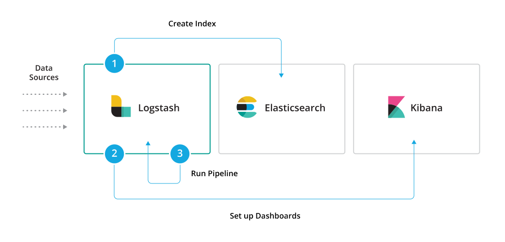

# 第8章-模块

Logstash模块提供了一个快速的端到端解决方案，用于采集数据并使用专用仪表板对其进行可视化。

可用模块包括：

- [Elastic Cloud](https://www.elastic.co/guide/en/logstash/6.7/connecting-to-cloud.html)
- [ArcSight 模块](https://www.elastic.co/guide/en/logstash/6.7/arcsight-module.html)
- [Netflow 模块](https://www.elastic.co/guide/en/logstash/6.7/netflow-module.html)
- [Microsoft Azure 模块](https://www.elastic.co/guide/en/logstash/6.7/azure-module.html)

以上每个模块都内置了Logstash配置、Kibana仪表板和其他元文件，使您可以更轻松地安装Elastic应用栈，并指定用例或数据源。

您可以将模块视为提供三个基本功能，使您更容易入门。运行模块时，它将：

1. 创建Elasticsearch索引。

2. 设置Kibana仪表板，包括在Kibana中可视化数据所需的索引匹配、搜索和可视化。

3. 使用读取和解析数据所需的配置，运行Logstash管道。



### 运行模块

要运行模块并设置仪表板，请指定以下选项：

```shell
bin/logstash --modules MODULE_NAME --setup [-M "CONFIG_SETTING=VALUE"]
```

此处：

- `--modules` 运行 `MODULE_NAME` 指定的Logstash模块。
- `-M "CONFIG_SETTING = VALUE"`是可选的，会覆盖默认的配置。您可以使用多次。每个覆盖必须以 `-M` 开头。有关详细信息，请参阅 [命令行指定模块设置](#命令行指定模块设置)。
- `--setup` 在Elasticsearch中创建索引匹配，并导入Kibana仪表板和可视化。运行 `--setup` 是一次性设置步骤。以后运行模块需省略此选项，以避免覆盖现有的Kibana仪表板。

例如，以下命令使用默认设置运行Netflow模块，并设置netflow索引匹配和仪表板：

```shell
bin/logstash --modules netflow --setup
```

以下命令运行Netflow模块，并覆盖Elasticsearch主机设置。这里假设您已经运行了设置步骤。

```shell
bin/logstash --modules netflow -M "netflow.var.elasticsearch.host=es.mycloud.com"
```

### 配置模块

要配置模块，您可以在 [logstash.yml](../04-Setting-Up-and-Running-Logstash/logstash.yml.md) 中 [设置模块](#`logstash.yml` 设置模块)，也可以使用 [命令行设置模块](#命令行设置模块)。

#### `logstash.yml` 设置模块

要在 [`logstash.yml`](../04-Setting-Up-and-Running-Logstash/logstash.yml.md) 中设置模块，请将模块定义添加到模块数组。每个模块的定义以短横线（ - ）开头，接着写 `name: module_name`，然后是一系列设置模块的键/值对。例如：

```yaml
modules:
- name: netflow
  var.elasticsearch.hosts: "es.mycloud.com"
  var.elasticsearch.username: "foo"
  var.elasticsearch.password: "password"
  var.kibana.host: "kb.mycloud.com"
  var.kibana.username: "foo"
  var.kibana.password: "password"
  var.input.tcp.port: 5606
```

#### 命令行设置模块

在启动Logstash时，你可以通过指定一个或多个配置来覆盖模块设置，可使用 `-M` 命令行选项：

```shell
-M MODULE_NAME.var.PLUGINTYPE1.PLUGINNAME1.KEY1=VALUE
```

请注意，完全限定的设置名称包括模块名称。

您可以指定多个覆盖。每个覆盖必须以 `-M` 开头。

以下命令运行Netflow模块，并覆盖Elasticsearch的 `host` 和 `udp.port`设置：

```shell
bin/logstash --modules netflow -M "netflow.var.input.udp.port=3555" -M "netflow.var.elasticsearch.hosts=my-es-cloud"
```

命令行中声明的任何设置都是临时的，并且不会在后续的Logstash运行中保留。如果要保留配置，则需要在 [`logstash.yml`](../04-Setting-Up-and-Running-Logstash/logstash.yml.md) 中进行设置。

您在命令行中指定的设置，将与 `logstash.yml` 文件中的对应设置合并。如果在两处都设置了同一个选项，则命令行中指定的值优先。
