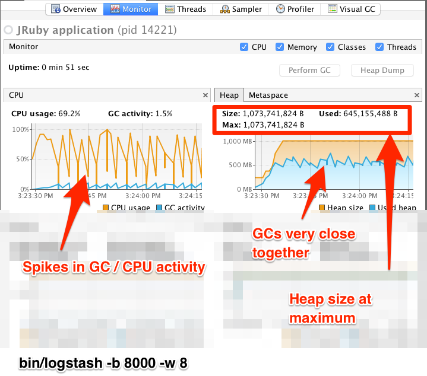
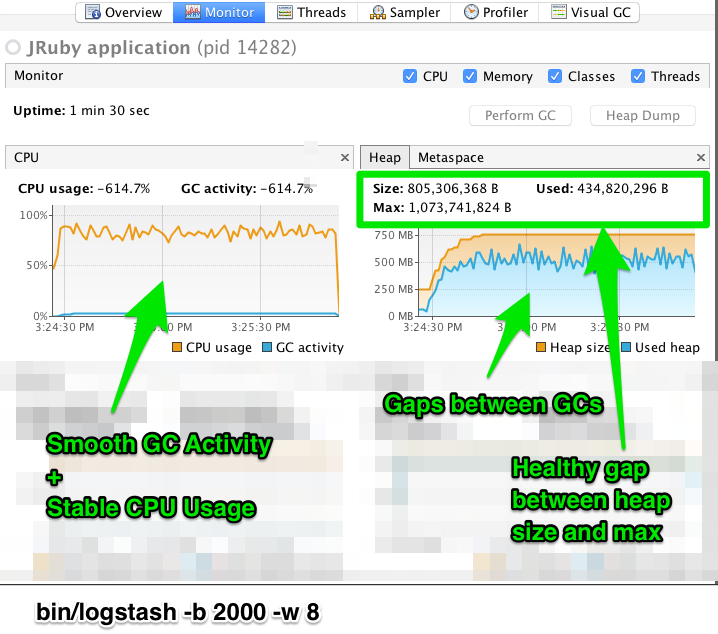

## 性能调试和查看

选择Logstash默认值可为大多数用户提供快速、安全的性能。但是，如果您发现性能问题，则可能需要修改某些默认值。 Logstash提供了以下用于调优管道性能的可配置选项：`pipeline.workers`，`pipeline.batch.size` 和 `pipeline.batch.delay`。有关设置这些选项的更多信息，请参阅 [logstash.yml](../04-Setting-Up-and-Running-Logstash/logstash.yml.md)。

在修改这些选项之前，请确保已阅读 [性能故障排除指南](../13-Performance-Tuning/Performance-Troubleshooting-Guide.md)。

- `pipeline.workers` 决定了运行筛选和输出处理的线程数。如果发现事件正在备份，或者CPU未饱和，请考虑增加此参数的值，以更好地利用系统性能，甚至这个数字超过可用处理器数量时，有可能产生更好的效果，因为这些线程在写入外部系统时可能在I/O等待状态中花费大量时间。此参数的合法值是正整数。
- `pipeline.batch.size` 定义了单个工作线程在尝试执行过滤器和输出之前，收集的最大事件数。较大的参数值通常更有效，但会增加内存开销。某些硬件配置要求您在 `jvm.options` 中增加JVM堆空间，以避免性能下降。（有关详细信息，请参阅 [Logstash配置文件](../04-Setting-Up-and-Running-Logstash/Logstash-Configuration-Files.md) ）超出最佳范围的值，会因频繁的垃圾回收或与内存不足等异常，导致JVM崩溃而使性能下降。输出插件可以将每个批处理作为逻辑单元。例如，Elasticsearch输出会为收到的每个批次发出 [批量请求](https://www.elastic.co/guide/en/elasticsearch/reference/current/docs-bulk.html)。调整 `pipeline.batch.size` 设置可调整发送到Elasticsearch的批量请求的大小。
- 很少需要调整 `pipeline.batch.delay` 。此设置调整Logstash管道的延迟。管道批处理延迟是Logstash在当前管道工作线程中，接收事件后等待新消息的最长时间（以毫秒为单位）。超过此时间后，Logstash开始执行过滤器和输出。Logstash在接收事件和处理过滤器中的事件之间，等待的最长时间是 `pipeline.batch.delay` 和 `pipeline.batch.size` 的乘积。

#### 管道配置和性能的说明

如果您计划修改默认管道设置，请考虑以下建议：

- 未完成事件的总数由 `pipeline.workers` 和 `pipeline.batch.size` 的乘积决定，这被称为飞行计数（inflight count）。在调整 `pipeline.workers` 和 `pipeline.batch.size` 时，请记住飞行计数的值。不定期接收大量事件的流水线，需要足够的内存来处理这些尖峰。在 `jvm.options` 中相应地设置JVM堆空间。 （有关详细信息，请参阅 [Logstash配置文件](../04-Setting-Up-and-Running-Logstash/Logstash-Configuration-Files.md)。）
- 测量每个变化，以确保它增加而不是降低性能。
- 确保留出足够的可用内存以应对事件大小的突然增加。例如，应用程序生成储存为大段文本的异常信息。
- 由于输出通常在I/O闲置等待，因此可以将工作器数设置为高于CPU核心数。
- Java中的线程具有名称，您可以使用 `jstack`，`top` 和VisualVM图形工具来确定给定线程使用的资源。
- 在Linux平台上，Logstash使用描述性内容标记它可以使用的所有线程。例如，输入显示为 `[base]<inputname`, 管道工作人员显示为`[base]>workerN`，其中N是整数。在可能的情况下，还会标记其他线程以帮助您确定其用途。

#### 堆性能分析

调整Logstash时，您可能需要调整堆大小。您可以使用 [VisualVM](https://visualvm.github.io) 工具来分析堆。特别是Monitor窗格对于检查堆分配是否足以满足当前工作负载非常有用。下面的屏幕截图显示了示例Monitor窗格。第一个窗格检查配置了太多机上事件的Logstash实例。第二个窗格检查配置了适当数量飞行事件的Logstash实例。请注意，此处使用的批处理大小很可能不适用于您的工作负载，因为Logstash的内存需求在很大程度上取决于您发送的消息类型。

在第一个例子中，我们看到CPU没有得到非常有效的使用。实际上，JVM经常需要停止VM以获得"完全GC"。完全GC是过度记忆压力的常见症状。这在CPU图表上的尖峰图案中可见。在更有效配置的示例中，GC图形模式更平滑，并且CPU以更均匀的方式运行。您还可以看到在分配的堆大小和允许的最大值之间有足够的空间，这为JVM GC提供了很大的工作空间。

使用类似于优秀 [VisualGC](https://visualvm.github.io/plugins.html) 插件的工具检查深入的GC统计数据表明，与资源密集程度较高的旧"完全GC"所花费的时间相比，过度分配的VM在高效的Eden GC中花费的时间非常少。 

> **注意：**
> 只要GC模式可以接受，偶尔增加到最大值的堆大小是可以接受的。这种堆大小的峰值响应于通过管道的大量事件爆发而发生。在一半情况下，保持使用的堆内存量与最大值之间的差距。本文档不是JVM GC调优的综合指南。阅读 [官方Oracle指南](https://www.oracle.com/webfolder/technetwork/tutorials/obe/java/gc01/index.html)，了解有关该主题的更多信息。我们还建议阅读调试Java性能。
