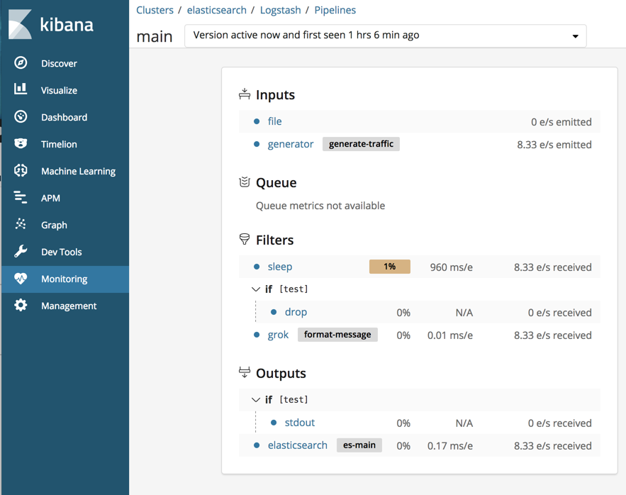
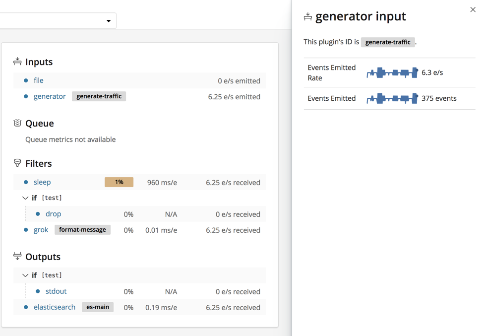

## 管道视图UI

使用管道视图可以可视化和监视复杂Logstash管道配置的行为。您可以查看树视图并与之交互，以说明管道拓扑，数据流和分支逻辑。

管道查看器在值异常的情况下突出显示CPU％和事件延迟。此信息可帮助您快速识别过于缓慢的处理。

#### 前置条件

在使用管道查看器之前：

- [配置Logstash监控](../14-Monitoring-Logstash/README.md)。
- 启动要监视的Logstash管道。

Logstash开始将指标发送到监控集群。

#### 查看管道

要查看管道：

- Kibana→监控→Logstash→管道

每个管道由管道ID（默认为 `main`）标识。对于每个管道，您将看到管道的吞吐量，以及在所选时间范围内管道运行的节点数。

树中的许多元素都是可点击的。例如，您可以单击插件名称以展开详细信息视图。

单击分支名称旁边的箭头以折叠或展开它。

#### 注意事项和最佳实践

**使用语义化ID**。在Logstash管道中配置阶段时指定语义化ID。否则，Logstash会为您生成它们。语义ID可帮助您识别导致瓶颈的配置。例如，您可能在管道中运行了几个grok过滤器。如果您指定了语义ID，则可以快速了解哪些过滤器很慢。语义ID（例如 `apacheParsingGrok` 和 `cloudwatchGrok`）指向导致瓶颈的grok过滤器。

**离群值**。突出显示异常缓慢或偏离异常的值和统计信息。这并不一定表明存在问题，但它突出了潜在的瓶颈，以便您可以快速找到它们。

由于工作性质的原因，有些插件比其他插件慢。例如，您可能会发现使用复杂正则表达式的grok过滤器，比仅添加字段的mutate过滤器运行速度慢很多。在这种情况下，可能会突出显示grok过滤器，但可能无法进一步优化其工作。

**版本**。版本信息可从管道ID旁边的下拉列表中获得。 Logstash每次修改管道时都会生成一个新版本，并存储多个版本的管道统计信息。使用此信息可以查看随时间的变化如何影响吞吐量和其他指标。 Logstash不存储多个版本的管道配置。
